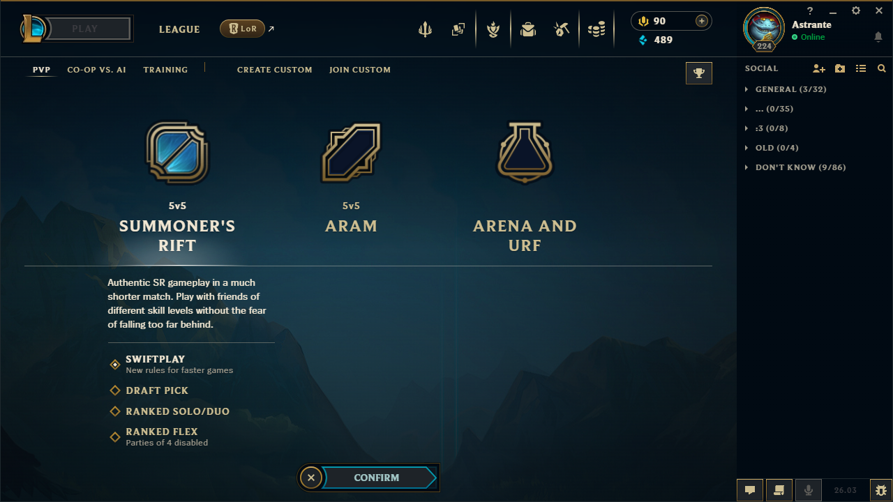
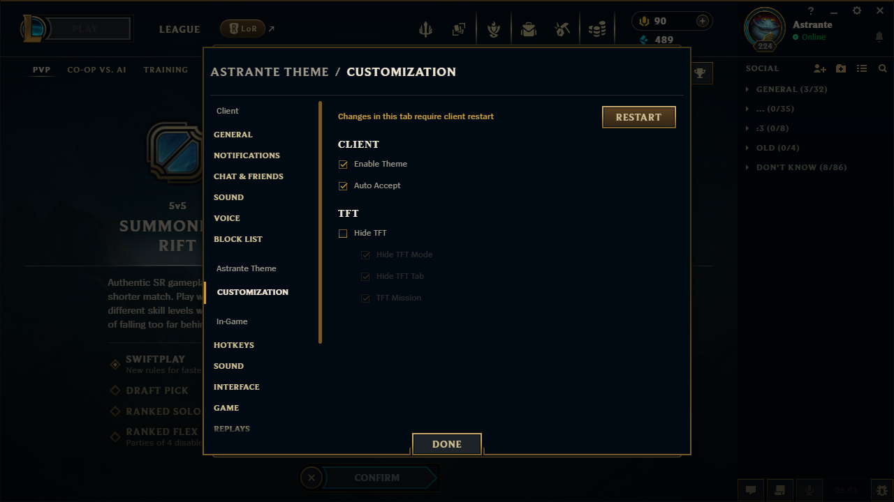

# ✨ Astrante Theme

**Extension for League of Legends client**  
*(works with [Pengu Loader](https://pengu.lol/))*

[Read in other languages](/src/locales/readMe) 🌍

---

## 📸 Screenshots

---

### Features

- **Auto Accept** — Automatically accept match making queue
- **Hide TFT Tab** — Clean up your client
- **Wallpapers** — Coming soon

### Installation

#### Method 1: Installer (Recommended)

1. Install PenguLoader (if not yet) — download it [here](https://github.com/PenguLoader/PenguLoader/releases/)
2. Open Pengu Loader → **Plugins** → **Open folder** → copy the path
3. Download the latest installer from [Releases](https://github.com/Astrante/astrante-lol-client-extention/releases/latest)
4. Run `AstranteTheme-Installer.exe`
5. Paste copied path (or choose plugins folder) (e.g., `C:\PenguLoader\plugins`)
6. Click "Install"
7. Open Pengu Loader → **Plugins** → Select **AstranteTheme**
8. Restart LoL client

#### Method 2: Manual

1. Install PenguLoader (if not yet) — download it [here](https://github.com/PenguLoader/PenguLoader/releases/)
2. Open Pengu Loader → **Plugins** → **Open folder**
3. Download the latest release from [Releases](https://github.com/Astrante/astrante-lol-client-extention/releases/latest)
4. Extract the archive
5. Copy to opened plugins folder (`AstranteTheme/` should be inside)
6. Open Pengu Loader → **Plugins** → Select **AstranteTheme**
7. Restart LoL client

### Languages

- 🇬🇧 English
- 🇷🇺 Russian
- 🌍 More coming soon

### Support

- 📧 [GitHub Issues](https://github.com/Astrante/astrante-lol-client-extention/issues)

---

## 📜 License

MIT License - see [LICENSE](LICENSE) for details

Made with ❤️ by [Astrante](https://github.com/Astrante)

